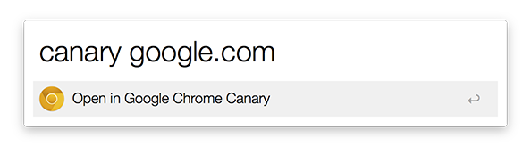

Open in Google Chrome Canary ([Download v1.0](https://github.com/fza/alfred-chromecanary-workflow/raw/master/chromecanary.alfredworkflow))
=====================

This is an Alfred 2 workflow to open a URL in Google Chrome Canary. There are many [other solutions](http://support.alfredapp.com/workflows:config:actions-open-url) and some provide way more functionality, but this one works best for me – as simple as it is.

## Requirements
1. [Alfred App v2](http://www.alfredapp.com/#download)
1. [Alfred Powerpack](https://buy.alfredapp.com/)

## Installing
1. Click the download button (above)
2. Double-click to import workflow into Alfred 2
3. Make sure that you have "Google Chrome Canary.app" in your applications folder
3. Review the workflow to add a custom hotkey or change the keyword

## Commands
- `canary {query}`

## Contributors
- [@fza](https://github.com/fza)
